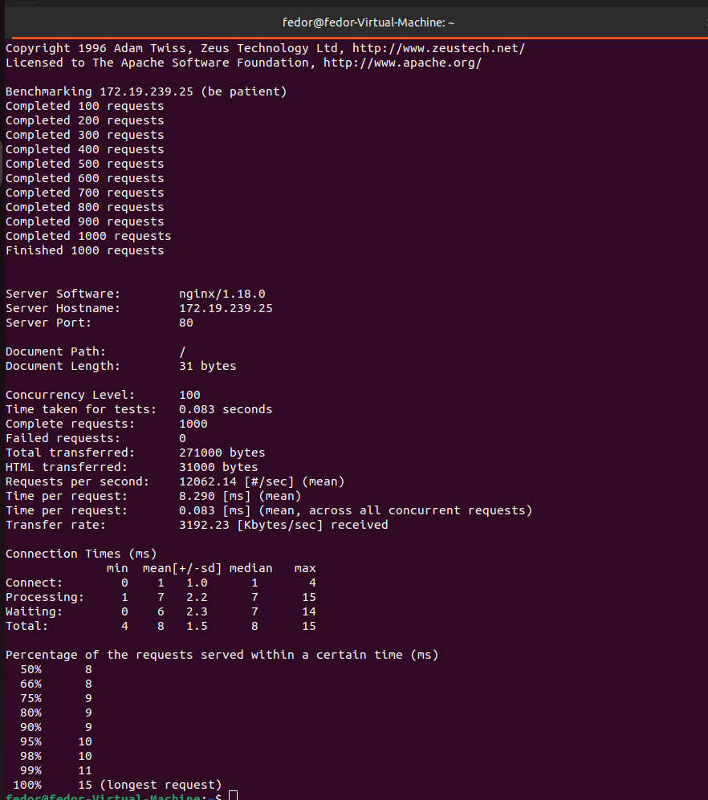
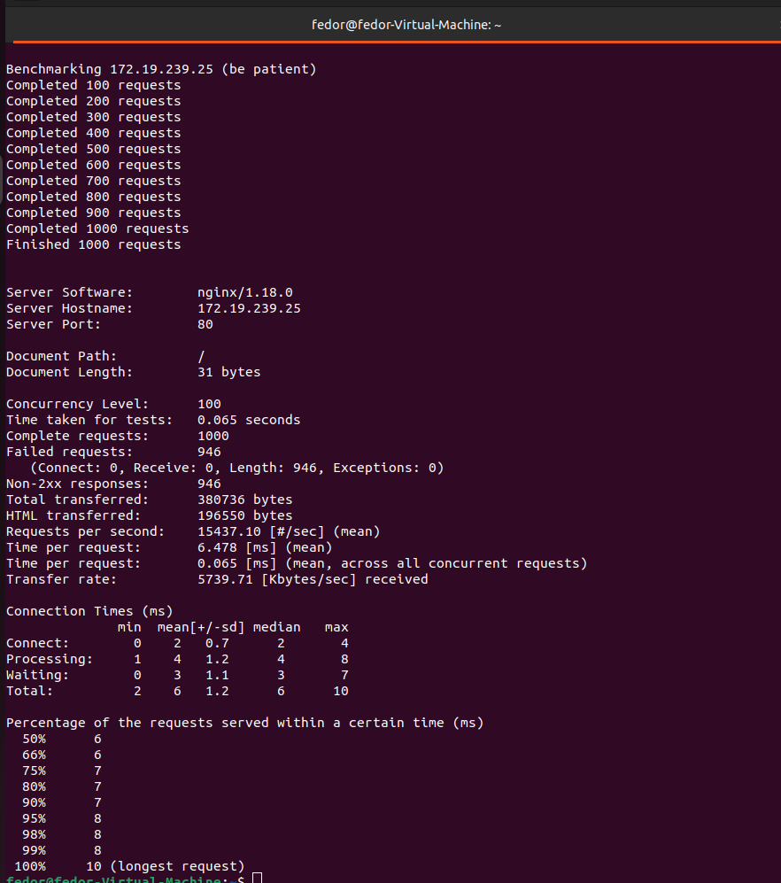
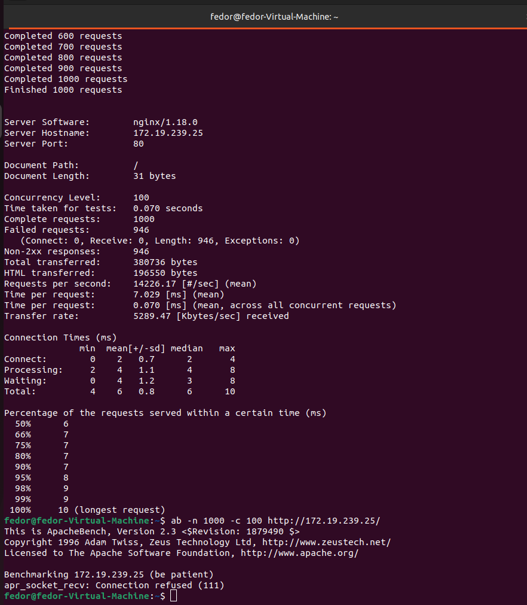
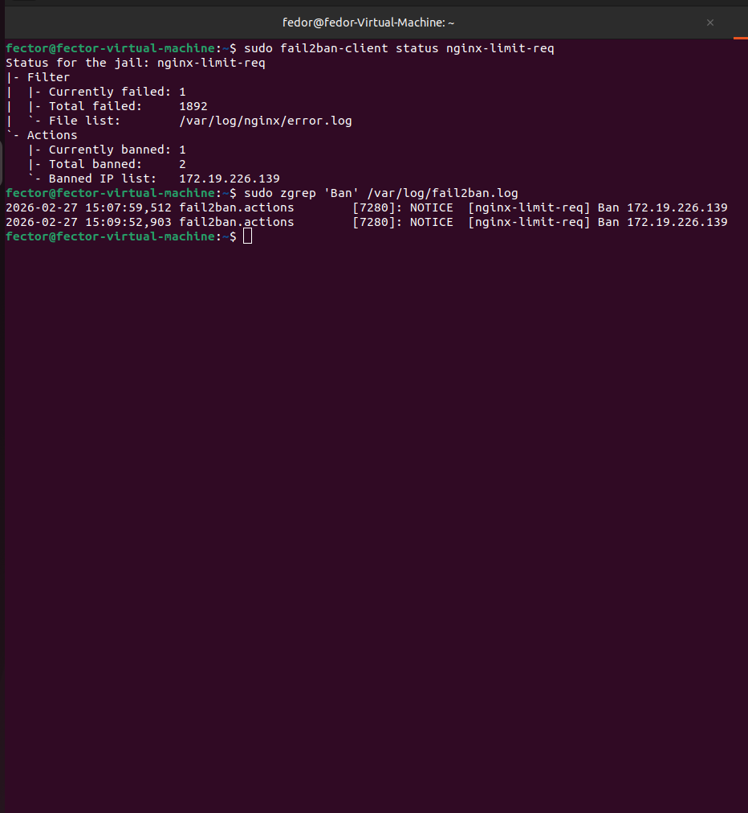
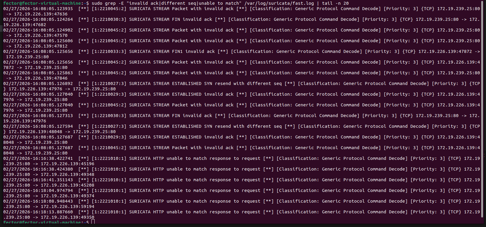

# Домашнее задание к занятию «Организация безопасности сети» - Лунев Федор Владимирович

## 1. Rate Limit

### Результат:

Пришлите следующие скриншоты:

1. Скриншот с запросами `ab` до включения limit_req на nginx

2. Скриншот с запросами `ab` после включения limit_req на nginx

3. Скриншот с запросами `ab` после включения fail2ban (не обязательно)

---

## 2. Suricata*

Опишите поведение suricata (сообщения, появляющиеся в log-файле) после:

---

## 1. 10 000 запросов по 100

В логах фиксируется множество аномалий TCP-уровня (STREAM FIN invalid ack, Packet with invalid ack, SYN resend with different seq). Из за высокой плотности трафика нарушается последовательность пакетов, что IDS классифицирует как подозрительное поведение.

---

## 2. 10 000 запросов по 1000

Нагрузка становится критической. Помимо TCP-ошибок, появляются алерты прикладного уровня: HTTP unable to match response to request. Система обнаружения вторжений перестает успевать сопоставлять пары «запрос-ответ» из за хаоса в сетевом стеке

## 3. 10 000 запросов по 10

Интенсивность низкая, общая работоспособность не нарушается, но Suricata всё равно может фиксировать единичные нарушения структуры TCP-пакетов (invalid ack), реагируя на микрозадержки утилиты ab.

---
